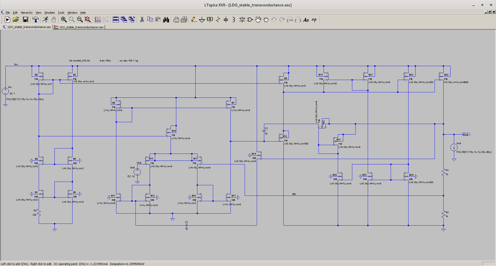

# LDO
A simple LDO circuit capable of 3-Ampere output current, Iout

Output voltage, Vout could be determined or changed using Vref voltage source which is just a simplification of bandgap circuit.

Note;
1. AC analysis Measurements are done using output load capacitance Cout of 10uF
2. Both line and load regulation are tested without any output load capacitance Cout

Power Dissipation : 6.1 mW

Gain: 70 dB

Unity-Gain Bandwidth: 39.7 kHz

Phase Margin: 69.1 degrees

PSRR : 65 dB

load regulation : maximum 500mV change in Vout during sudden change (1us rise or fall time) of load current (from Iout=3A to Iout=0A, and vice-versa)

line regulation : maximum 8mV change in Vout during sudden change (1us rise or fall time) of input voltage (from Vin=5V to Vin=5.5V, and vice-versa)

TODO: 
1. Improve the phase margin of the LDO when there is no Cout (for acting as dominant pole)
2. Improve load regulation metric result

Circuit Mechanism Explanation:

1. Transient performance enhancement circuit consisting of M19, M27, M23, M24 and M25 work by passing extra biasing current through M18
2. M14 acts as active miller compensation together with C1.  M21, M22 and C2 act as dynamic miller compensation circuit.

Credit: Reddit forum
