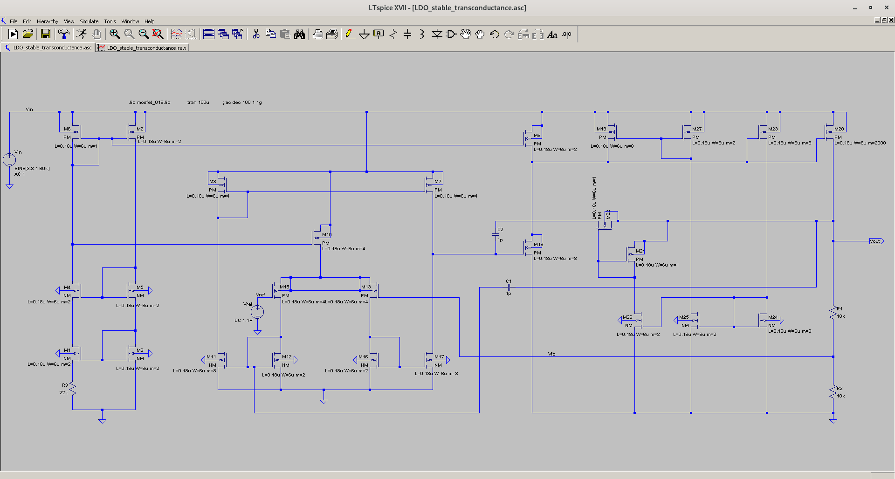
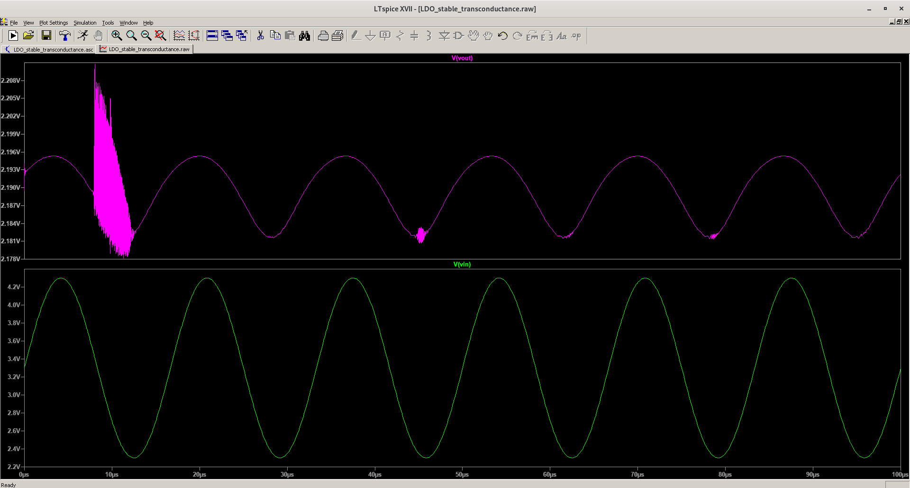
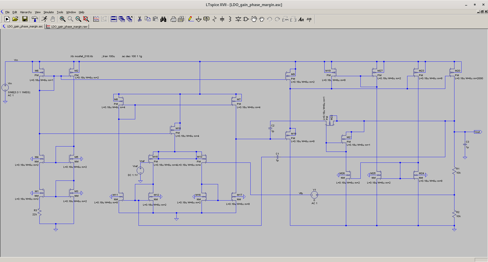
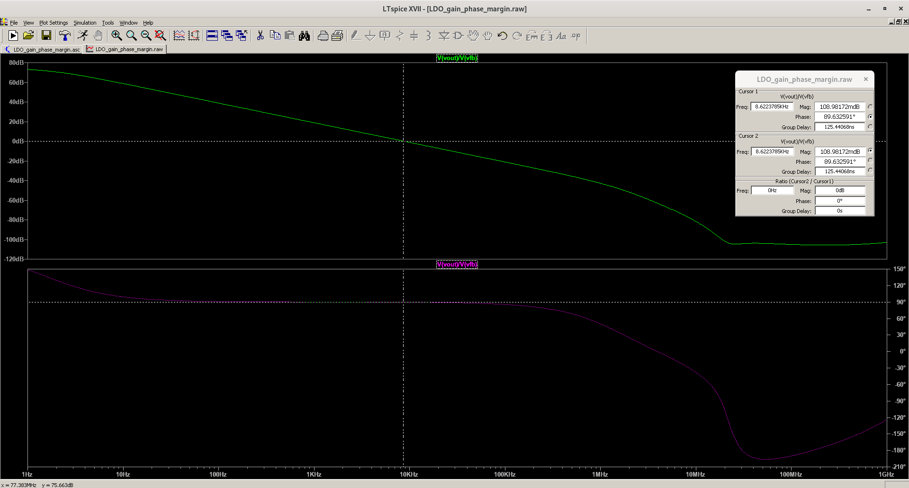
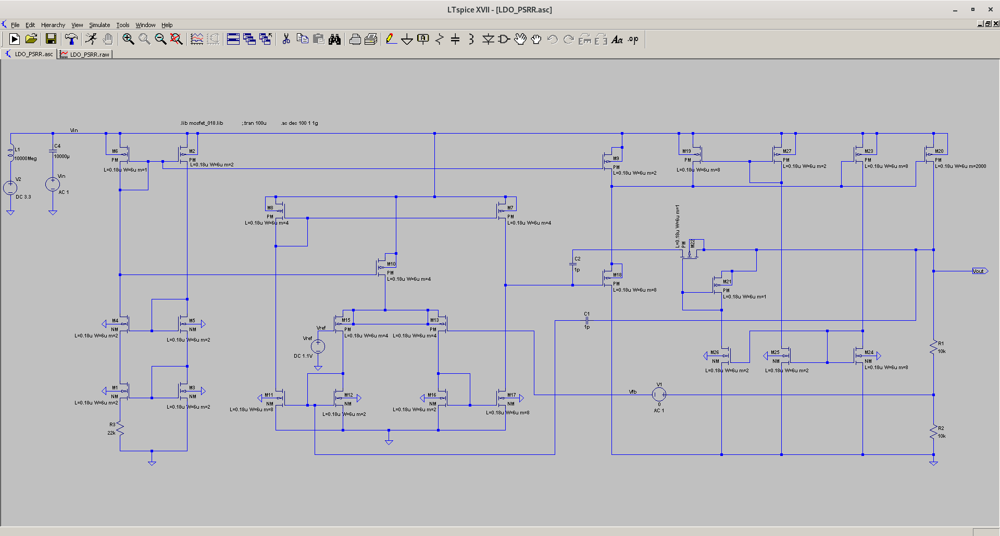
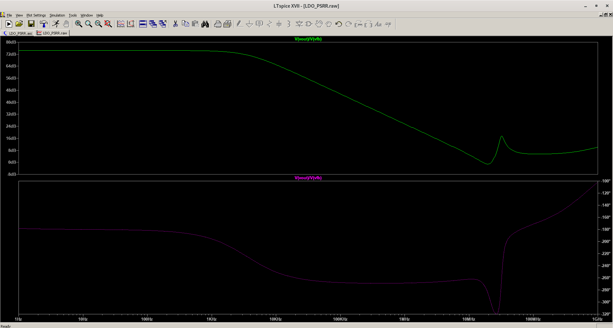

# LDO
A simple LDO circuit

Measurements are done using output load capacitance CL of 1uF

Gain: 75 dB

Unity-Gain Bandwidth: 8.63 kHz

Phase Margin: 90.37 degrees

PSRR : 74 dB

line regulation : ±8 mV around nominal output voltage

TODO: 
1. Improve the initial transient noise durng power startup
2. Improve the bandwidth of the LDO
3. Load regulation metric result
4. Understanding the mechanism of transient performance enhancement circuit consisting of M19, M27, M23, M24 and M25
5. Investigate the purpose of M2 and M26

Credit: eevblog forum
